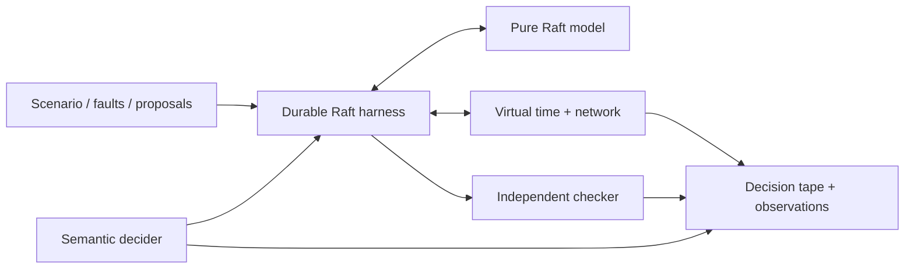

# d-raft

[](https://github.com/aminkbi/d-raft/actions/workflows/ci.yml)
[](https://pkg.go.dev/github.com/aminkbi/d-raft)
[](LICENSE)

**Deterministic Raft experiments with durable, replayable decisions.**

d-raft is a research platform for turning distributed-systems failures into
small, independently checkable execution artifacts. It combines a pure Raft
reference state machine with virtual time, a faultable network, explicit
persistence acknowledgements, crash/restart simulation, semantic decision
recording, and independent safety checks.

The project is created and maintained by
[Mohammadamin Khanbabaei (`aminkbi`)](https://github.com/aminkbi).

> **Research status:** the deterministic kernel, durable reference Raft model,
> cluster harness, safety checker, observational trace decoder, and exact
> semantic decision replay are implemented. Run artifacts, exploration,
> counterexample minimization, snapshots, joint consensus, and production
> adapters remain active research work.

## Why d-raft?

A seed says how to repeat one pseudorandom run in one implementation. A useful
counterexample should say *which semantic choices mattered*, retain evidence
of the violated invariant, survive irrelevant changes in random-number
consumption, and be portable to another implementation.

d-raft's working research direction is therefore:

> Portable, minimized, independently checkable semantic Raft
> counterexamples that replay across implementations and versions.

Deterministic simulation, pure `Step` APIs, seeded replay, and trace reduction
all have substantial prior art. d-raft does not present those techniques alone
as novel; [RESEARCH.md](RESEARCH.md) defines the narrower thesis and evaluation
plan.

## What works today

| Package | Role |
| --- | --- |
| `sim` | Protocol-neutral virtual-time scheduler, stable RNG streams, typed network, partitions, and observational JSONL traces |
| `raft` | Pure deterministic Raft reference state machine with elections, heartbeats, log replication, current-term commit, and leader no-op entries |
| `raftsim` | Durable storage, timers, network delivery, partitions, crash/restart, process incarnations, and persistence barriers |
| `check` | Independent election, voting, term, log, commit, and apply safety witnesses with stable fingerprints |
| `decision` | Versioned semantic choices, seeded selection, recording, exact tape replay, and domain-drift detection |
| `trace` | Bounded, line-aware, payload-lossless decoder for known `d-raft.trace/v1` fields |

The root module is dependency-free and uses no wall-clock sleeps or background
goroutines. It targets Go 1.26 and declares the current Go 1.26.6 toolchain.

## Architecture



The persistence boundary is explicit:

```text
Step(input)
  -> Persist(token, state)
  -> simulated durable completion
  -> Step(Persisted(token))
  -> dependent messages, timers, and apply effects
```

A crash destroys volatile `raft.Node` state. Restart creates a fresh node only
from the durable store. This lets tests distinguish a crash immediately before
persistence from one immediately after it.

## Quick start

```go
config := raftsim.DefaultConfig("a", "b", "c")
config.Seed = 42

cluster, err := raftsim.New(config)
if err != nil {
    log.Fatal(err)
}
if _, err := cluster.RunUntil(2 * time.Second); err != nil {
    log.Fatal(err)
}

leader, ok := cluster.Leader()
if !ok {
    log.Fatal("no unique leader")
}
if err := cluster.ProposeTo(leader, []byte("set x=1")); err != nil {
    log.Fatal(err)
}
```

Partitions, scheduled crashes, restarts, and crash-after-persist boundaries are
available directly on `raftsim.Cluster`. Every semantic step is checked; when
`StopOnViolation` is enabled, a run stops at the first safety violation.

## Replay semantic decisions

Recording is separate from the observational trace. The choice tape describes
election timeouts, network loss and latency, and storage completion latency by
stable semantic identity.

```go
recorder := decision.NewRecorder(decision.NewSeedDecider(42))
config.Decider = recorder
original, _ := raftsim.New(config)
_, _ = original.RunUntil(2 * time.Second)

tape := recorder.Tape()
replay, _ := decision.NewTapeDecider(tape)
config.Seed = 999 // infrastructure RNG no longer controls these choices
config.Decider = replay
replayed, _ := raftsim.New(config)
_, _ = replayed.RunUntil(2 * time.Second)
if err := replay.Finish(); err != nil {
    log.Fatal(err)
}
```

`TapeDecider` stops at the first choice ID, kind, domain, or selection mismatch.
This makes replay drift explicit instead of silently producing a different run.
Exact execution also requires the same scenario version, external actions, and
run horizon; the forthcoming run-artifact format will bundle those inputs.

## Observational traces

`sim.JSONLRecorder` emits globally ordered `d-raft.trace/v1` JSON Lines.
`trace.Decoder` enforces schema and sequence rules, supports compatible and
strict validation, bounds record size, and preserves protocol payloads as
`json.RawMessage` so 64-bit terms and indexes are never routed through
`float64`.

The observational trace and semantic decision tape are deliberately distinct:
the former explains what happened; the latter drives an execution.

## Determinism boundary

For a fixed d-raft version, initial state, API-call sequence, decision tape or
seed, and deterministic callbacks, d-raft reproduces virtual time, event and
packet order, protocol state, durable state, and trace output. Unordered map
iteration, wall-clock reads, external I/O, concurrent callbacks, and mutation
after an inadequately cloned send are outside that guarantee. See
[COMPATIBILITY.md](COMPATIBILITY.md).

## Development

```bash
go test ./...
go vet ./...
go test -race ./...
```

Contributions should include a deterministic regression test and, for protocol
changes, a crash-boundary test where persistence matters. See
[CONTRIBUTING.md](CONTRIBUTING.md).

## Prior art and positioning

d-raft builds on ideas demonstrated by etcd/raft's deterministic core and TLA+
trace validation, FoundationDB simulation, DEMi, SAMC, MadSim/MadRaft, Oddity,
Coyote, Turmoil, VOPR, and commercial deterministic-testing systems such as
Antithesis. The intended contribution is a portable semantic counterexample
format and reduction/evaluation workflow, not another claim that seeded
simulation itself is new.

## Citation and license

If d-raft supports published work, cite the repository using
[`CITATION.cff`](CITATION.cff) and record the release or commit, Go toolchain,
scenario version, adapter version, and semantic tape schema.

Licensed under [Apache 2.0](LICENSE).
