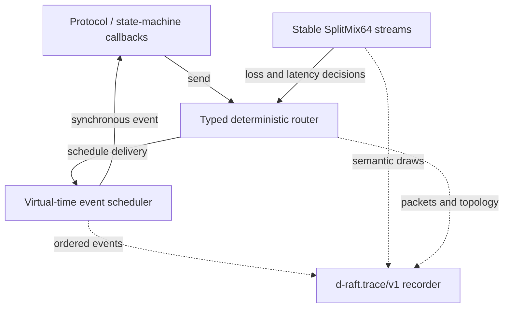

# d-raft

[](https://github.com/aminkbi/d-raft/actions/workflows/ci.yml)
[](https://pkg.go.dev/github.com/aminkbi/d-raft)
[](LICENSE)

d-raft is a deterministic discrete-event simulation kernel for repeatable
tests of consensus protocols and other distributed state machines. It is the
foundation of a larger deterministic Raft testing project; it does not yet
implement the Raft protocol itself.

The Go module is small, dependency-free, and deliberately uses no
`time.Sleep`, timers, channels, or goroutines. It targets Go 1.26 with the
latest patch toolchain declared in [`go.mod`](go.mod).

Created and maintained by
[Mohammadamin Khanbabaei (aminkbi)](https://github.com/aminkbi).

> **Research status:** the simulation kernel and trace schema are usable now.
> The reference Raft state machine, replay engine, invariant checker, and trace
> minimizer are planned work. See [RESEARCH.md](RESEARCH.md) for the research
> questions and evaluation plan.

## Architecture



The simulator owns time and ordering. Protocol callbacks are synchronous, the
router turns sends into scheduled events, and independently split random
streams prevent unrelated choices from shifting one another. Sharing one
recorder preserves the exact cross-component observation order.

## Deterministic contract

- Virtual time advances only when the simulator executes an event or
  `RunUntil` explicitly advances it.
- A binary min-heap orders events by time. Events at the same time run in FIFO
  scheduling order, including events scheduled reentrantly by callbacks.
- The built-in SplitMix64 wrapper has a stable, package-owned bit stream. A
  `uint64` seed reproduces results across machines and Go releases.
- The typed router supports directed per-link loss and inclusive nanosecond
  latency ranges, mutable-message snapshot functions, dynamic endpoint
  registration, lifecycle tracing, and directed partition matrices.
- Active partitions are checked at send and delivery time. A partition can
  therefore cut a packet already in flight.
- A shared trace recorder assigns scheduler, random, and network events one
  synchronous global order.

Determinism also requires deterministic application callbacks. In particular,
do not let unordered map iteration, wall-clock reads, global random state,
concurrent work, or external I/O decide which simulation operation runs next.
The full stability boundary is documented in [COMPATIBILITY.md](COMPATIBILITY.md).

## Basic use

```go
simulation := sim.New()
networkRandom := sim.NewRand(42)
router, err := sim.NewRouter(
    simulation,
    networkRandom,
    sim.LinkConfig{
        MinLatency:      5 * time.Millisecond,
        MaxLatency:      25 * time.Millisecond,
        LossProbability: 0.01,
    },
    func(m Message) Message { return m },
)
if err != nil {
    t.Fatal(err)
}

router.Register("node-1", node1.Handle)
router.Register("node-2", node2.Handle)
router.Send("node-1", "node-2", Message{Term: 4})

simulation.RunUntil(10 * time.Second)
```

For mutable messages, provide a real snapshot function. `CloneBytes` is
included for `[]byte`. Passing `nil` uses assignment and is appropriate for
immutable messages and value types.

## Machine-readable traces

Attach one recorder to every component whose decisions belong in the same
execution. Each line is a `d-raft.trace/v1` JSON object with a global sequence
number. Times and durations are integer nanoseconds; `uint64` random values are
strings so JSON consumers cannot lose precision.

```go
var output bytes.Buffer
trace := sim.NewJSONLRecorder(&output)

simulation.SetTraceSink(trace)
networkRandom.SetTraceSink(trace, "network")
router.SetTraceSink(trace)

// Run the scenario, then check encoding or writer failures.
simulation.Run()
if err := trace.Err(); err != nil {
    t.Fatal(err)
}
```

The stream covers event scheduling, cancellation and execution; explicit
clock advances; semantic random operations; endpoint and link changes;
partition matrices; and packet scheduling, delivery, drops, and JSON-encoded
message snapshots. Tracing is synchronous and trace sinks must not call back
into a component, because doing so could affect event ordering.

## Partitions

Symmetric groups cover the common split-brain case:

```go
split, err := sim.NewPartitions(
    []sim.NodeID{"node-1", "node-2"},
    []sim.NodeID{"node-3", "node-4", "node-5"},
)
router.SetPartition(split)

// Heal every link.
router.SetPartition(nil)
```

Use `NewPartitionMatrix` for asymmetric failures. Rows are sources, columns
are destinations, and `true` permits a packet. A node omitted from an active
matrix is isolated.

For randomized protocols, derive separate streams with `Rand.Split` so that
network fault draws do not shift when a node adds an unrelated random choice.

## Development

```bash
go test ./...
go vet ./...
go test -bench . -benchmem ./...
```

The project is licensed under [Apache 2.0](LICENSE).

## Citation

If d-raft supports published work, cite the repository using
[`CITATION.cff`](CITATION.cff). Research reports should include the d-raft
version or commit, Go toolchain, seed or trace, and scenario configuration.
