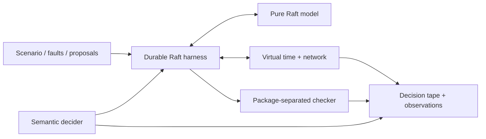

# d-raft

[](https://github.com/aminkbi/d-raft/actions/workflows/ci.yml)
[](https://pkg.go.dev/github.com/aminkbi/d-raft)
[](LICENSE)

**Deterministic Raft experiments with durable, replayable decisions.**

d-raft is a research platform for turning distributed-systems failures into
small, independently checkable execution artifacts. It combines a pure Raft
reference state machine with virtual time, a faultable network, explicit
persistence acknowledgements, crash/restart simulation, semantic decision
recording, and package-separated safety checks with structured witnesses.

The project is created and maintained by
[Mohammadamin Khanbabaei (`aminkbi`)](https://github.com/aminkbi).

> **Research status:** the deterministic kernel, durable reference Raft model,
> cluster harness, safety checker, observational trace decoder, and exact
> semantic decision replay are implemented. Self-describing run artifacts and
> the research CLI are also usable. Bounded prefix exploration and
> fingerprint-preserving semantic minimization are implemented. Durable
> snapshots, safe log compaction, and snapshot-bearing run artifacts are also
> implemented. Joint-consensus membership changes and learners are implemented,
> including durable recovery and snapshot-aware configuration state. An
> experimental adapter for the production-used `go.etcd.io/raft/v3` core is
> implemented for a declared fixed-membership capability subset. A versioned,
> portable binary KV application oracle now produces independently checkable
> state/history commitments in both adapters, including reference snapshot
> recovery. A versioned six-fault corpus and isolated, repository-pinned
> runner are implemented with a clean Go 1.26.6 result: three checker-backed
> safety kills and three separately reported conformance kills. Strict
> adapter-neutral semantic plans, bilateral capability preflight, projection
> accounting, normalized outcomes/comparisons, source-provenance verification,
> and a two-adapter research CLI are implemented. The public comparative corpus
> and report remain active work.

## Why d-raft?

A seed says how to repeat one pseudorandom run in one implementation. A useful
counterexample should say *which semantic choices mattered*, retain evidence
of the violated invariant, survive irrelevant changes in random-number
consumption, and be portable to another implementation.

d-raft's working research direction is therefore:

> Portable, minimized, independently checkable semantic Raft
> counterexamples that replay across implementations and versions.

Deterministic simulation, pure `Step` APIs, seeded replay, and trace reduction
all have substantial prior art. d-raft does not present those techniques alone
as novel; [RESEARCH.md](RESEARCH.md) defines the narrower thesis and evaluation
plan.

## What works today

| Package | Role |
| --- | --- |
| `sim` | Protocol-neutral virtual-time scheduler, stable RNG streams, typed network, partitions, and observational JSONL traces |
| `raft` | Pure deterministic Raft reference state machine with elections, replication, current-term commit, snapshots, compaction, joint consensus, learners, and leader no-op entries |
| `raftsim` | Durable storage, timers, network delivery, partitions, crash/restart, snapshot installation, membership actions, process incarnations, and persistence barriers |
| `check` | Package-separated election, voting, term, log, commit, apply, snapshot, and membership-transition witnesses with stable fingerprints |
| `decision` | Versioned semantic choices, seeded selection, recording, exact tape replay, and domain-drift detection |
| `trace` | Bounded, line-aware, payload-lossless decoder for known `d-raft.trace/v1` fields |
| `artifact` | Strict, self-describing `d-raft.run/v3` artifacts with scenarios, voter/learner roles, configuration actions, environment, tape, outcome, digest, and witnesses; legacy v1/v2 decoding remains available |
| `apporacle` | Strict binary KV commands, canonical checkpoints, known-answer vectors, and adapter-neutral state/history commitments |
| `semanticplan` | Strict portable plan/capability/execution schemas, plan-aware projection proof checks, negotiated invariant universes, normalized outcomes, and outcome-bound comparisons |
| `experiment` | Clean-run execution of versioned scenarios and proposal, snapshot, begin/finalize membership, crash/restart, partition, and heal actions |
| `cmd/draft` | `run`, `explore`, `replay`, `minimize`, and `inspect` research workflow |
| `explore` | Clean-rerun bounded DFS with deterministic suffix completion and collision-safe canonical-state pruning |
| `minimize` | Scenario ddmin, sparse semantic guidance reduction, and domain-aware selection shrinking |
| `mutant` | Strict pinned mutant manifests, isolated worktree execution, bounded evidence, and closed outcome classification |
| `cmd/draft-mutants` | Seeded-mutant corpus runner with atomic, no-overwrite JSON result publication |
| `adapters/etcdraft` | Experimental `go.etcd.io/raft/v3` v3.7.0 production-core adapter with conservative checking and adapter-local exact replay |
| `adapters/etcdraft/cmd/draft-cross` | Replay-verified plan derivation plus private, no-clobber, manifest-committed comparative bundles and end-to-end verification |

The root module is dependency-free and uses no wall-clock sleeps or background
goroutines. The isolated nested etcd/raft adapter carries its production-core
dependency. Both target Go 1.26 and declare the current Go 1.26.6 toolchain.

See [MUTANTS.md](MUTANTS.md) for the seeded-fault evaluation contract and
runner trust boundary. See [SEMANTIC_PLANS.md](SEMANTIC_PLANS.md) for the
cross-adapter portability and comparison contract.

## Architecture



The persistence boundary is explicit:

```text
Step(input)
  -> Persist(token, state)
  -> simulated durable completion
  -> Step(Persisted(token))
  -> dependent messages, timers, apply, and snapshot-install effects
```

A crash destroys volatile `raft.Node` state. Restart creates a fresh node only
from the durable store. This lets tests distinguish a crash immediately before
persistence from one immediately after it.

## Quick start

```go
config := raftsim.DefaultConfig("a", "b", "c")
config.Seed = 42

cluster, err := raftsim.New(config)
if err != nil {
    log.Fatal(err)
}
if _, err := cluster.RunUntil(2 * time.Second); err != nil {
    log.Fatal(err)
}

leader, ok := cluster.Leader()
if !ok {
    log.Fatal("no unique leader")
}
if err := cluster.ProposeTo(leader, []byte("set x=1")); err != nil {
    log.Fatal(err)
}
```

Partitions, scheduled crashes, restarts, and crash-after-persist boundaries are
available directly on `raftsim.Cluster`. Every semantic step is checked; when
`StopOnViolation` is enabled, a run stops at the first safety violation.

## Replay semantic decisions

Recording is separate from the observational trace. The choice tape describes
election timeouts, network loss and latency, and storage completion latency by
stable semantic identity.

```go
recorder := decision.NewRecorder(decision.NewSeedDecider(42))
config.Decider = recorder
original, _ := raftsim.New(config)
_, _ = original.RunUntil(2 * time.Second)

tape := recorder.Tape()
replay, _ := decision.NewTapeDecider(tape)
config.Seed = 999 // infrastructure RNG no longer controls these choices
config.Decider = replay
replayed, _ := raftsim.New(config)
_, _ = replayed.RunUntil(2 * time.Second)
if err := replay.Finish(); err != nil {
    log.Fatal(err)
}
```

`TapeDecider` stops at the first choice ID, kind, domain, or selection mismatch.
This makes replay drift explicit instead of silently producing a different run.
Exact execution also requires the same scenario version, external actions, and
run horizon; `d-raft.run/v3` bundles those inputs with the tape.

## Command-line workflow

Build the research CLI and create a self-contained run artifact:

```bash
go build -o draft ./cmd/draft
./draft run --seed 42 --duration 2s --out run.json
./draft inspect run.json
./draft replay run.json
./draft explore --depth 6 --max-runs 1000
./draft explore --cache=false --depth 6 --max-runs 1000 # matched baseline
./draft minimize --out minimized.json failing.json
```

`draft replay` starts from a clean cluster, consumes the stored choice tape,
rejects any semantic drift, and verifies the recorded outcome status, step
count, virtual end time, violation fingerprints, and versioned canonical
observation digest. Artifact writes use a temporary file and atomic no-clobber
publication, so an encoding or filesystem failure does not leave a plausible
partial result. Artifacts remain private (`0600`) by default.

`draft run` and `draft explore` currently generate a steady all-voter scenario.
The v3 schema and Go APIs can also execute scheduled proposals, snapshots,
joint membership transitions, partitions, healing, crashes, and restarts,
including the crash-after-persistence-before-acknowledgement boundary. Role
changes are limited to a pre-provisioned `Members` universe; they do not perform
dynamic discovery or process creation. Named CLI fault suites and broader
production adapters are later milestones. The experimental etcd/raft
production-core adapter and separate `draft-etcd` CLI are documented in
[ADAPTERS.md](ADAPTERS.md). Canonical reference-state caching is enabled by
default for `draft explore` and bounded with `--cache-entries` and
`--cache-bytes`. See
[ARTIFACTS.md](ARTIFACTS.md), [MEMBERSHIP.md](MEMBERSHIP.md),
[SNAPSHOTS.md](SNAPSHOTS.md), [EXPLORATION.md](EXPLORATION.md),
[CANONICAL_STATE.md](CANONICAL_STATE.md), and
[MINIMIZATION.md](MINIMIZATION.md). The opt-in cross-adapter application profile
is specified in [APPLICATION_ORACLE.md](APPLICATION_ORACLE.md).

## Observational traces

`sim.JSONLRecorder` emits globally ordered `d-raft.trace/v1` JSON Lines.
`trace.Decoder` enforces schema and sequence rules, supports compatible and
strict validation, bounds record size, and preserves protocol payloads as
`json.RawMessage` so 64-bit terms and indexes are never routed through
`float64`.

The observational trace and semantic decision tape are deliberately distinct:
the former explains what happened; the latter drives an execution.

## Determinism boundary

For a fixed d-raft version, initial state, API-call sequence, decision tape or
seed, and deterministic callbacks, d-raft reproduces virtual time, event and
packet order, protocol state, durable state, and trace output. Unordered map
iteration, wall-clock reads, external I/O, concurrent callbacks, and mutation
after an inadequately cloned send are outside that guarantee. See
[COMPATIBILITY.md](COMPATIBILITY.md).

## Development

```bash
go test ./...
go vet ./...
go test -race ./...

cd adapters/etcdraft
go test ./...
go vet ./...
go test -race ./...
```

Contributions should include a deterministic regression test and, for protocol
changes, a crash-boundary test where persistence matters. See
[CONTRIBUTING.md](CONTRIBUTING.md).

## Prior art and positioning

d-raft builds on ideas demonstrated by etcd/raft's deterministic core and TLA+
trace validation, FoundationDB simulation, DEMi, SAMC, MadSim/MadRaft, Oddity,
Coyote, Turmoil, VOPR, and commercial deterministic-testing systems such as
Antithesis. The research target is a portable semantic counterexample format
and reduction/evaluation workflow, not another claim that seeded simulation
itself is new.

## Citation and license

If d-raft supports published work, cite the repository using
[`CITATION.cff`](CITATION.cff) and record the release or commit, Go toolchain,
scenario version, adapter version, and semantic tape schema.

Licensed under [Apache 2.0](LICENSE).
